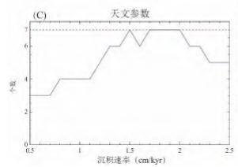
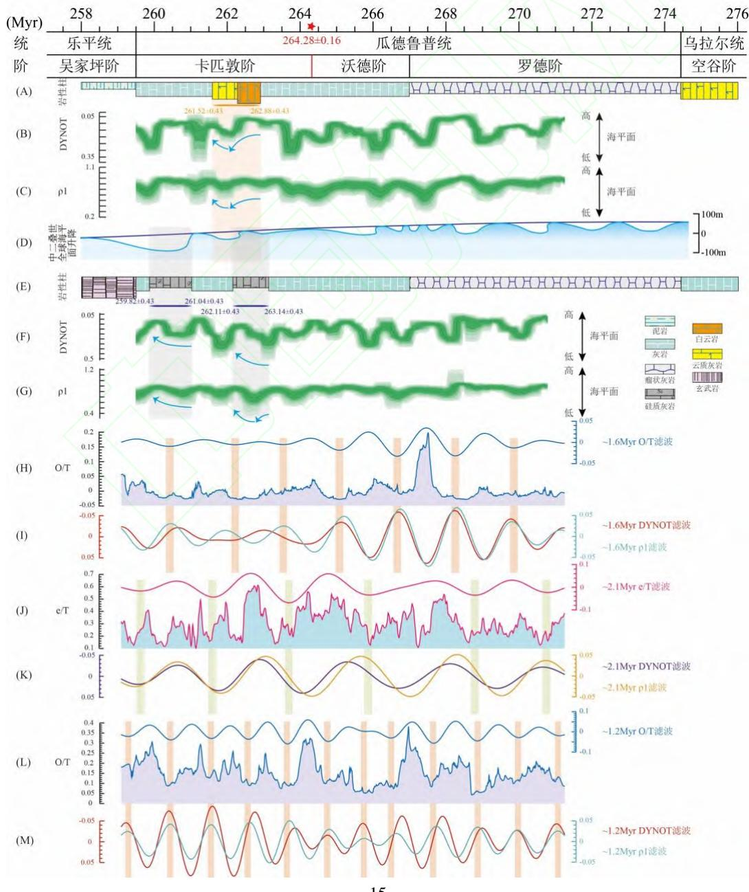

# 《矿物岩石》网络首发论文

题目： 天文轨道、峨眉山地幔柱与川南中二叠世茅口期构造-沉积分异的耦合关系作者： 许文龙，陈奕霖，袁海锋，陈聪，高兆龙，匡明志，肖钦仁，王涛，弓永铭网络首发日期： 2026-08-25

引用格式： 许文龙，陈奕霖，袁海锋，陈聪，高兆龙，匡明志，肖钦仁，王涛，弓永铭．天文轨道、峨眉山地幔柱与川南中二叠世茅口期构造-沉积分异的耦合关系[J/OL]．矿物岩石. https://link.cnki.net/urlid/51.1143.TD.20260824.1829.005

网络首发：在编辑部工作流程中，稿件从录用到出版要经历录用定稿、排版定稿、整期汇编定稿等阶段。录用定稿指内容已经确定，且通过同行评议、主编终审同意刊用的稿件。排版定稿指录用定稿按照期刊特定版式（包括网络呈现版式）排版后的稿件，可暂不确定出版年、卷、期和页码。整期汇编定稿指出版年、卷、期、页码均已确定的印刷或数字出版的整期汇编稿件。录用定稿网络首发稿件内容必须符合《出版管理条例》和《期刊出版管理规定》的有关规定；学术研究成果具有创新性、科学性和先进性，符合编辑部对刊文的录用要求，不存在学术不端行为及其他侵权行为；稿件内容应基本符合国家有关书刊编辑、出版的技术标准，正确使用和统一规范语言文字、符号、数字、外文字母、法定计量单位及地图标注等。为确保录用定稿网络首发的严肃性，录用定稿一经发布，不得修改论文题目、作者、机构名称和学术内容，只可基于编辑规范进行少量文字的修改。

出版确认：纸质期刊编辑部通过与《中国学术期刊（光盘版）》电子杂志社有限公司签约，在《中国学术期刊（网络版）》出版传播平台上创办与纸质期刊内容一致的网络版，以单篇或整期出版形式，在印刷出版之前刊发论文的录用定稿、排版定稿、整期汇编定稿。因为《中国学术期刊（网络版）》是国家新闻出版广电总局批准的网络连续型出版物（ISSN2096-4188 CN.11-6037/7） 所以签约期刊的网络版上网络首发论文视为正式出版。

# 天文轨道、峨眉山地幔柱与川南中二叠世茅口期构造-沉积分异的耦合关系

许文龙 1，陈奕霖 1，袁海锋 1，陈聪 2，高兆龙 2，匡明志 3，

肖钦仁 1，王涛 1，弓永铭 1

1.成都理工大学能源学院（页岩气现代产业学院），四川 成都 610059；2.中国石油西南油气田分公司勘探开发研究院，四川 成都 610041；3.中国石油西南油气田分公司川中油气矿，四川 遂宁 629000

【摘 要】 绵竹-蓬溪台洼、广元-开江陆棚及剑阁-丰都台缘带的发现，证实川中-川北茅口期存在显著的构造-沉积分异，并控制了茅二段滩相白云岩储层的展布。在峨眉山地幔柱活动背景下，川南茅口组亦表现出显著的构造-沉积分异特征，但其启动时间与驱动机制尚不明确。本文基于川南不同沉积相带 GS1 井与YD1 井茅口组的天文旋回地层学研究，建立了高分辨率天文年代标尺，限定了构造-沉积分异的启动时间，揭示了超长轨道周期对海平面升降的驱动作用，并探讨了天文轨道与峨眉山地幔柱活动在构造-沉积分异中的耦合关系。研究表明：①川南茅口组发育多级沉积旋回，记录了 405 ka 长偏心率、\~100 ka 短偏心率及\~40 ka 斜率周期信号，沉积时限为\~271-\~259 Ma，持续时间\~12 Ma；②川南茅口期识别出\~2.1-\~2.3 Ma 偏心率调制周期（g4-g3）与\~1.2-\~1.6 Ma斜率调制周期（s4-s3），其中s4-s3周期与\~1.2-\~1.6 Ma海平面变化周期呈显著反相位关系，表明在茅口期温室气候背景下，斜率可能是调控海平面升降的重要驱动机制；③川南茅口期构造-沉积分异启动时间为\~263 Ma，与峨眉山地幔柱水下喷发时间吻合，揭示峨眉山地幔柱活动是驱动构造-沉积分异的关键因素，其效应叠加天文轨道周期调制与上升流作用，促进了川南茅口组台缘带云化滩的发育。本文进一步为茅口组勘探思路由“岩溶控储”向“相带控储”转变提供依据和借鉴。

【关键词】 川南地区；茅口组；超长轨道周期；峨眉山地幔柱；构造-沉积分异

## 0 引言

四川盆地中二叠统茅口组是深层海相油气勘探的热点层系。近年来，茅二段滩相白云岩储层取得巨大勘探突破，已成为增储上产的主要阵地。基于目前的勘探成效，学者们持续深化茅口组基础地质研究，意识到规模性白云岩储层具有明显的相控特征，勘探重点随之由“岩溶缝洞型灰岩储层 转至 相控复合型白云岩储层 ，更加强调 沉积控储 [1]。因此，重建茅口期岩相古地理格局成为了重点工作。早期观点认为茅口期沉积稳定，属于典型的浅水碳酸盐台地，亦有主张其为碳酸盐缓坡沉积[1]。目前多数学者基本达成共识，指出茅口期存在显著的构造-沉积分异，中-晚期发生了从缓坡向台地的转变[1]。受峨眉山地幔柱隆升影响，茅一段-茅二下亚段的沉积体系为碳酸盐缓坡[1]。茅二上亚段沉积期，峨眉山地幔柱活动加剧，形成了近 400 km 的剑阁-丰都大型台缘带及向北一侧的海槽[1]。上述台缘-海槽结构的横向变化，揭示了川中-川北在茅二上沉积期发生了显著的构造-沉积分异[1]。此外，孟宪武等[2]指出川南茅口组也具有类似的开阔台地-台地边缘-深水陆棚的构造-沉积分异结构。尽管袁海锋等[1]基于川中-川北野外露头、钻井及牙形刺化石等资料，将构造-沉积分异限定在卡匹敦阶J.altudaensis带（263\~262 Ma），并归因于峨眉山地幔柱活动，但针对川南茅口组，该构造-沉积分异的启动时间与驱动机制依然尚待深入探索。

沉积地层记录不仅受控于区域性构造活动，还深刻响应着由地球轨道参数的（准）周期性变化[3]。地球轨道参数的（准）周期性变化调控着大气层顶太阳辐射的纬向分布与季节性配置，驱动全球气候与海平面 104\~106 年尺度的（准）周期性波动，并最终记录在对气候变化敏感的沉积系统中，形成米兰科维奇旋回[3]。天文旋回地层学即以米兰科维奇理论为基础，借助各类古气候指标，识别、对比并解读地层中的天文旋回信号，构建高精度天文年代标尺，实现地层精细划分、对比与定年，为沉积演化等研究提供关键依据[3]。近年来，华南地区中二叠世已陆续建立多个浮动天文年代标尺，但卡匹敦阶持续时间存在差异[4, 5]，这可能与全球性海平面下降导致的沉积间断有关[6]。随着天文年代框架的逐步完善，当前研究也逐渐关注天文轨道驱动机制。部分学者已在华南地区中二叠世沉积记录中识别出多个天文轨道周期，并探讨了其对海平面变化、陆源输入、季风气候波动与上升流变化的调控作用[4-5, 7-8]。然而，针对川南茅口组的天文旋回地层学研究仍相对薄弱。

综上所述，本文选取川南相带差异显著的 GS1（浅水台缘）与 YD1（深水陆棚）开展研究，将同生期-准同生期白云岩的高精度 U-Pb 定年作为辅助年龄锚点，基于自然伽马测井序列构建了茅口组高分辨率天文年代标尺。其中，GS1 的滩相白云岩清晰记录了相对海平面波动的沉积响应，而 YD1 的深水沉积则有效印证了峨眉山地幔柱活动诱发的构造沉降。通过两井横向对比，本文旨在：①限定川南茅口组构造-沉积分异的启动时间，并探讨其潜在的动力学成因；②揭示川南茅口期相对海平面变化的天文轨道驱动机制；③阐明海平面升降对川南茅口组白云岩储层发育的控制作用，最终揭示天文轨道与地幔柱活动对构造-沉积分异的耦合控制机制。

## 1 地质概况

四川盆地位于我国西南部，为上扬子地区次级构造单元，是典型多旋回叠合盆地。盆地北邻米仓山 大巴山造山带，西接龙门山造山带，东依齐岳山造山带，南抵大凉山 大娄山造山带[9]。依据地理-构造属性，盆地可划分为川北低陡褶皱、川西坳陷、川中低缓褶皱、川东高陡褶皱和川南低陡褶皱五个构造带。研究区位于盆地南部，涵盖宜宾、威远等市，属于川南低陡褶皱构造带（图 1A，图 1B）。

受冈瓦纳大陆冰川事件、加里东运动及海西运动的影响，四川盆地奥陶系至下二叠统不同程度缺失。早二叠世，极地冰川消融引发海平面上升并淹没古陆，盆地再次接受沉积。海侵初期，形成一套以滨岸、沼泽相为主的梁山组含煤层系；栖霞早期，海侵持续发育，沉积深水缓坡相的深色灰岩和硅质岩；栖霞中-晚期，海平面逐渐下降，发育浅水台地相滩体。中二叠世早期（茅口早期），海侵再次发育且规模扩大，盆地持续沉积海相碳酸盐岩；中二叠世中-晚期（茅口中-晚期），全球海平面大幅下降，叠加东吴运动隆升效应，盆地主要沉积浅水台地相碳酸盐岩，并在宜宾-赤水一带发育台缘带（图 1B）[2]。同期，华南板块西缘峨眉山地幔柱喷发形成峨眉山大火成岩省（ELIP）（图 1A）[10 该活动对川中-川北茅口组构造-沉积分异具有显著控制作用，影响了茅口组的沉积演的川南茅口组，孟宪武等[2]指出其在晚期同样存在构 人研究基础上，补充了川南茅二上亚段岩石学资料，结果显示： 发育颗粒灰岩、灰质云岩及白云岩；而在 YD1、三道水等 主（图 2）。基于上述特征，进一步明确了川南茅二上亚段 了川南在茅二上沉积期经历了显著的构造-沉积分异。

茅口组为上扬子地区瓜德鲁普世（中二叠世）沉积的碳酸盐岩序列，在四川盆地多数区域稳定发育，总体呈现向上变浅的二级旋回。茅口组通常与下伏栖霞组、上覆龙潭组/吴家坪组呈整合或平行不整合接触，在乐山-宣威地区茅口组上部则发育峨眉山玄武岩组。茅口组通常被划分为茅一段-茅三段，川南地区可进一步识别出茅四段，岩相垂向分异明显（图1C，图 3）。其中，茅一段主体为深灰色富泥瘤状灰岩，局部发育中-厚层灰色生屑灰岩，伽马值整体较高；茅二段以较纯的中-厚层浅色生屑灰岩为主，局部层段发育白云岩，伽马值整体相对较低，其下部伽马曲线保持低值，上部轻微升高后逐渐下降，据此可细分为茅二下亚段与茅二上亚段；茅三段整体发育生屑灰岩，偶见硅质团块，厚度较薄，局部地区异常增厚并发育颗粒灰岩；茅四段发育范围基本局限于川南地区，整体以高伽马深灰色泥晶灰岩为特征。

  
图1 研究区位置及概况  
Fig.1 The location and general situation of the study area

A.四川盆地地质图、构造单元划分及峨眉山大火成岩省分布（据文献[9, 10]修改）；B.川南地区茅二段晚期岩相古地理（据文献[1]修改）；C.ELIP内带—中带—外带二叠系地层综合柱状图（据文献[11]修改）。

  
图2 研究区茅二上亚段岩性特征  
Fig.2 Lithological characteristics of the upper sub - member of the second member of the Maokou Formation in the study area

A.细—中晶白云岩，晶间（溶）孔充填方解石，GS1，3914 m；B.细—中晶白云岩，发育晶间（溶）孔，GS1，3916 m；C.细—中晶白云岩，GS1，3910 m；D.细—中晶白云岩，可见雾心亮边结构，新基姑剖面；E.残余生屑白云岩，可见生屑颗粒幻影，新基姑剖面；F.灰质云岩，TY1，2728 m；G.亮晶生屑灰岩，见䗴类（Fu.），指示浅水环境，M11，2680 m；H.泥质生屑灰岩，富有孔虫（Fo.）与放射虫（Ra.），指示深水环境，YD1，910 m；I.硅质岩，可见生屑颗粒原始结构，YD1，944 m；J.同 I视域的正交偏光；K.硅质岩，发育海绵骨针（Ss.），YD1，856 m；L.同K视域的正交偏光；M.硅质岩，大水剖面；N.硅质岩，三道水剖面； 硅质岩 硅质灰岩互层，三道水剖面； 硅质岩，柳溪电站剖面。

## 2 数据和方法

## 2.1 旋回地层学分析

自然伽马测井（GR）是天文旋回分析中最灵敏、最理想的古气候替代指标之一，应用尤为广泛。GR 值主要反映沉积物中 U、Th 和 K 的含量，这些元素多富集于细粒沉积中。在暖湿气候条件下，水流与化学风化作用增强，陆源输入增多，黏土矿物及有机质含量升高，GR值随之增大；反之在干冷气候条件下，GR值则相应减小。此外，GR具备分辨率高、连续性好和信噪比高的优势，对岩性-岩相变化较敏感，因此被广泛应用于古气候重建、古环境恢复及天文旋回地层学研究。本文基于 GS1 与 YD1 茅口组 GR（图 3），采用 Acycle v2.8软件开展旋回地层学分析[12]。两井深度域 GR 为 0.125 m 采样率的连续序列，无需预处理，可直接通过去趋势化排除沉积环境、构造活动等非天文轨道的干扰，其中 GS1 去趋势化窗口为 8%；YD1 去趋势化窗口为 7%。对去趋势化后的深度域 GR进行多窗口能谱分析（Multi-taper method，MTM），评估各周期频率的能量分布，识别置信区间内的主周期，并比对高置信区间主周期是否接近天文轨道周期（长偏心率 E，短偏心率 e，斜率 O，岁差 P）之间的比值，初步判定对应天文轨道驱动的沉积旋回周期。同时，利用快速傅里叶变换（Fast Fouriertransform，FFT）开展演化能谱分析，揭示茅口组各周期随深度的变化特征，识别沉积速率波动与沉积间断，判断是否存在因沉积速率改变而导致米兰科维奇旋回的变化。基于 MTM能谱分析结果，进一步采用高斯带通滤波（Gaussian filter）提取目标周期（E，e，O，P）的天文信号，并依托提取出的深度域 405 ka 长偏心率周期建立年龄模型，将 GR 从深度域校准至时间域。对时间域 GR以采样率中值间距进行线性插值后（GS1：5.0625 Ka；YD1：3.5526ka），再次开展去趋势化、MTM 能谱分析与 FFT 演化能谱分析，并通过 Gaussian filter提取时间域 405 ka 长偏心率周期信号，建立 GS1 与 YD1 茅口组的浮动天文年代标尺。此外，基于袁海锋等[1]与匡明志[13]的研究，依据 GR特征及层序划分，将 GS1 与 YD1 茅口组和川中-川北钻井进行对比（重点为二崖剖面，匡明志[13]已建立绝对天文年代标尺，并统一对应至最新国际地层年代表（GTS2024））（图 3）。在此基础上，以卡匹敦阶底界（茅二上亚段底界）的年龄 $2 6 4 . 2 8 \pm 0 . 1 6 \mathrm { M a }$ 为锚点[14]，构建 GS1 与YD1 茅口组的绝对天文年代标尺。

为检验受天文轨道驱动的沉积速率，本文采用相关系数法（correlation coefficient，COCO）评估了 GS1 与 YD1 深度域 GR功率谱与天文解之间的相关系数。最优沉积速率通常具有最高相关系数（ρ）、最低零假设检验 $\left( \mathrm { { H } } _ { 0 } \right)$ 及最大数量参与计算的天文参数。此外，本文利用演化相关系数法（evolutionary correlation coefficient，eCOCO）揭示 GS1 与 YD1 茅口组沉积速率随时间或深度的变化规律。

根据旋回地层学理论，超长偏心率周期 $( g 4 \ – g 3 )$ 调制偏心率振幅，而超长斜率周期（s4-s3）则调制斜率振幅。由于能量分解分析（Power Decomposition Analysis，PDA）对岩性变化敏感度低，较传统对振幅包络线进行能谱分析更适合识别长周期旋回，因此本文对 和YD1 茅口组 GR的偏心率与斜率信号开展 500 ka滑动窗口 PDA[15]，识别并提取超长轨道周期，以探索茅口组百万年尺度的沉积记录、相对海平面变化与天文轨道周期的对应关系，揭示相对海平面变化的驱动机制。

此外，本文基于两种互补的沉积噪声模型：轨道调谐后的动态噪声模型（DYNOT）和lag-1 自相关系数模型（ρ1），构建川南茅口组相对海平面变化模拟。两者广泛应用于重建地质时期海平面相对变化，是揭示天文轨道对海平面升降驱动机制的重要手段[15]。DYNOT与ρ1 序列呈反相关，即 DYNOT 值降低与 ρ1 值升高均指示噪声减弱，反映海平面上升，反之则对应海平面下降。本文构建了 GS1 与 YD1 茅口组的海平面变化相关沉积噪声模型，并通过 5000 次蒙特卡洛（Monte Carlo）模拟开展不确定性评估。

## 2.2 U-Pb 定年及稀土元素

GS1 白云岩 U-Pb 定年及激光原位稀土元素在成都创源微谱科技有限公司利用 LA-ICP-MS 完成，该仪器由美国应用光谱公司的 RESOlution LR 193 nm ArF 准分子激光剥蚀系统与美国赛默飞公司的 组成。样品制备为 φ 2.5 cm靶，经抛光、超声波清洗后于 $4 5 { \sim } 6 0 ~ ^ { \circ } \mathrm { C }$ 烘干备用。使用NIST 612 调谐仪器灵敏度，并在激光剥蚀过程中通入少量高纯氮气（5 mL/min）以增强灵敏度。调谐参数设置为 50 μm、 $3 \ \mathrm { j } / \mathrm { c m } ^ { 2 } .$ 、10 Hz，速度为 3 μm/s。同时，在实验中确保 $^ { 2 3 2 } \mathrm { T h } ^ { 1 6 } \mathrm { O } / ^ { 2 3 2 } \mathrm { T h }$ 小于 1 %，238U 灵敏度大于 900 k cps。ICP 条件为：冷却气流速， $1 4 \mathrm { L / m i n } ;$ 等离子体功率，1550w；辅助气流速，0.8 L/min；雾化气流速，1.03L/min。激光剥蚀参数为光斑 $1 2 0 \mu \mathrm { m }$ 、频率 15 Hz、能量密度 $3 \mathrm { J } / \mathrm { c m } ^ { 2 }$ ，每个样品表面剥蚀 30 下用于清洗表面 Pb 污染，吹扫 7 s、本底收集 15 s、剥蚀 14\~18 s、最后吹扫 5 s。测试以 NIST 614为主标，校准碳酸盐标样和未知样品的 $^ { 2 0 7 } \mathrm { P b } / ^ { 2 0 6 } \mathrm { P b }$ 和 $^ { 2 3 8 } \mathrm { U } / ^ { 2 0 6 } \mathrm { P b }$ 比值，不进行分馏校正。使用 $\mathrm { A H X - 1 d } \left( 2 3 8 . 2 \pm 0 . 9 \mathrm { M a } \right)$ 校正样品的 238U/206Pb 比值及误差，以 PTKD-2 (153.7± 1.7 Ma)为副标监控数据质量。实验数据处理使用 IOLITE 软件，年龄计算及投图使用 Isoplot 4.0，原始稀土元素数据经过 PAAS标准化处理。

  
图3 川南—川中—川北茅口组沉积相连井剖面（据文献[1，13]修改，位置见图1A中蓝线）  
Fig.3 Connected - well section of sedimentary facies of the Maokou Formation from southern-central-northern Sichuan region

## 3 结果

## 3.1 沉积速率

茅口组大致对应于瓜德鲁普统（274.4\~259.51 Ma），持续时间\~14.89 Ma[11, 14]。GS1 茅口组厚度约 294 m，估算沉积速率约为 1.97 cm/ka。COCO 分析结果呈现 1.4、1.6、2.1 及 2.3cm/ka 共四个峰值。其中，2.1 cm/ka 峰值的 ρ 值最高（图 4A）。四个峰值的 $\mathrm { H } _ { 0 }$ 显著性水平均小于 0.01，而 2.1 cm/ka 峰值的 $\mathrm { H } _ { 0 }$ 则最小（图 4B）。此外，2.1 cm/ka 峰值的参与计算的天文轨道参数分量达到 6 个（图 4C）。综合判断，2.1 cm/ka 兼具可靠性与合理性，是 GS1 茅口组最优沉积速率，且与估算沉积速率 1.97 cm/ka 较接近。同时，eCOCO分析结果显示 GS1茅口组沉积速率波动整体稳定（图 4D）。

茅口组厚度约 ，估算沉积速率约为 。 分析识别出三个峰值，分别为 3.5、3.7 及 3.9 cm/ka。其中，3.5 cm/ka 峰值对应最高 $\rho$ 值（图 4E），且三个峰值 $\mathrm { H } _ { 0 }$ 显著水平均小于 0.01，而 3.5 cm/ka 峰值的 $\mathrm { H } _ { 0 }$ 最小（图 4F）。尽管 3.5 cm/ka 峰值仅涉及 5 个参与计算的天文轨道参数分量，少于 3.7 与 3.9 cm/ka 峰值（图 4G），但结合沉积速率估算值 2.85 cm/ka 来看，认为 3.5 cm/ka 更有可能是 YD1 茅口组的最优沉积速率。eCOCO 分析结果也表明 YD1 茅口组整体沉积速率波动相对稳定（图 4H）。值得注意的是，YD1 茅口组沉积速率高于 GS1，与高能相带沉积速率较高的认识存在一定差异。这可能是由于峨眉山地幔柱活动的影响，引发了 YD1 井区显著的构造沉降，导致可容纳空间急剧增加。同时，区别于川北地区物源匮乏的欠补偿深水海槽，YD1 紧邻浅水台缘带，繁盛的碳酸盐工厂可产生大量沉积物，并向邻近的陆棚区进行旁侧补给。此外，YD1 相对靠近ELIP，更易接受火山物质与热液硅质的外源输入。多源且充沛的沉积物供给与充足的可容纳空间共同造就了YD1 茅口组较高的沉积速率。

  
图 4 GS1 与 YD1 茅口组 GR 的 COCO、eCOCO 分析结果

Fig.4 Analysis results of COCO and eCOCO for GR of the Maokou Formation in Well GS1 and Well YD1A.GS1 的 COCO 相关系数；B.GS1 的 H0显著性水平；C.GS1 的天文轨道参数个数；D.GS1 的 eCOCO 相关系数；E.YD1 的 COCO 相关系数；F.YD1 的 H 显著性水平；G.YD1 的天文轨道参数个数；H.YD1 的 eCOCO相关系数。

## 3.2 能谱分析

通过 Waltham 2015 模型计算出中二叠世的 7 个轨道周期分别为 405 ka (E)、125 ka(e )、95 ka (e2)、36.1 ka (O)、21.95 ka (P1)、20.82 ka (P2)、17.83ka (P3)，对应比例为 22.71 (E) :7.01(e ) : 5.33 (e ) : 2.02 (O) : 1.23(P ) : 1.17(P ) : 1 (P )[16]。GS1 茅口组 GR 的 2π MTM 能谱分析显示，超过 99 %置信区间的周期有 10.07m、9.25m、6.71m、4.07m、2.93m、2.39m、2.07m 和 1.90 m；超过 95 %置信区间的周期有 12.25m、5.72m、3.39m、2.60m、1.98m 和 1.61m；超过 90%置信区间的周期有 22.62m、2.22m、1.55m、1.36m 和 1.28 m（图 5A）。其中10.07\~9.25m、4.07\~3.39m 及 1.55\~1.28 m 的比例约为 7.87-7.22 : 3.18-2.19 : 1.21-1，接近由Waltham 2015 模型计算出的 11.24 (E) : 3.47-2.64 (e) : 1 (O)。FFT 演化能谱分析进一步显示10.07\~9.25 m 沉积旋回整体稳定（图 5B）。基于上述结果，认为 GS1 茅口组 405 ka 轨道周期对应 10.07\~9.25 m 沉积旋回，由此推算出沉积速率约为 2.28\~2.49 cm/ka，与前文分析得出的最优沉积速率 2.1 cm/ka 接近，证实 GS1 茅口组记录了米兰科维奇信号。

YD1 茅口组 GR 的 2π MTM 能谱分析识别出超过 99%置信区间的周期包括 34.27m、22.85m、18.64m、14.76m、10.90m、8.24m、7.35m、6.44m、5.10m、4.53m、3.69m、3.34m、2.54m、2.25m、1.66m、1.56m 和 1.47 m；超过 95%置信区间的周期有 4.19m、3.09m、2.75m、2.41m、1.84m、1.23m 和 1.22 m；超过 90%置信区间的周期有 2.03m、1.33m、1.25m 和 1.11m（图 5C）。其中，14.76、4.53\~3.34 及 1.25\~1.11 m 的比例约为 13.30 : 4.08-2.67 : 1.13-1，接近 11.24 (E) : 3.47-2.64 (e) : 1 (O)。此外，14.76 m 沉积旋回在 FFT 演化能谱分析上整体相对稳定（图 5D）。根据分析结果，认为 YD1 茅口组 405 ka 轨道周期对应 14.76 m沉积旋回，据此计算出沉积速率约为 3.64 cm/ka，与前文分析得出的最优沉积速率 3.5 cm/ka 基本一致，同样证实 YD1 茅口组记录了米兰科维奇信号。

  
图5 GS1 与YD1茅口组GR的深度域2π MTM能谱分析、FFT演化能谱分析结果  
Fig.5 Analysis results of 2π MTM spectral analysis in the depth domain and FFT evolutionary spectral analysis of GR in the Maokou Formation in Well GS1 and Well YD1  
A.GS1 深度域 2π MTM 能谱分析；B.GS1 深度域 FFT 演化能谱分析；C.YD1 深度域 2π MTM 能谱分析；D.YD1深度域 FFT演化能谱分析。

## 3.3 滤波和调谐

根据 2π MTM 能谱分析与 COCO 分析结果，明确 10.07\~9.25 m 和 14.76 m 的沉积旋回分别对应 GS1 茅口组与 YD1 茅口组的 405 ka 长偏心率信号。利用 Gaussian filter 提取两井的深度域 405 ka 长偏心率信号（图 6A，图 6E），并据此建立年龄模型，将 GR由深度域转换至时间域（图 6B，图6F）。为验证天文调谐结果，对调谐后的时间域 GR开展 2π MTM 能谱分析与 FFT 演化能谱分析。结果显示，GS1 茅口组具有明显的 405 ka 长偏心率、95\~123ka 短偏心率和 44 ka 斜率周期信号（图 6C）；YD1 茅口组则具有明显的 405 ka 长偏心率、短偏心率和 斜率周期信号（图 ），且两者 长偏心率周期信号整体稳定（图 6D，图 6H）。上述结果进一步印证 GS1 茅口组和 YD1 茅口组 GR受到了米兰科维奇旋回的影响。此外，通过 Gaussian filter将时间域 GR的 405 ka 长偏心率周期提取出来，均识别出了\~30 个 405 ka 长偏心率旋回（图 6B，图 6F），与 Kerans et al.[17]在北美瓜德鲁普山中二叠统识别出的 30 个偏心率旋回一致。进一步参照最新国际地层年代表（GTS2024）中二叠统卡匹敦阶底界（茅二上亚段底界）的年龄 $2 6 4 . 2 8 \pm 0 . 1 6 \mathrm { M a }$ ，将其作为浮动天文年代标尺的锚点[14]，构建了 GS1 与 YD1 茅口组的绝对天文年代标尺（图 6B，图 6F）。考虑到卡匹敦阶底界（茅二上亚段底界）年龄存在 0.16 Ma 的不确定度，以及 405 ka 旋回计数存在0.4 Ma 的不确定度，因此年龄标尺具有 $( 0 . 1 6 ^ { 2 } + 0 . 4 ^ { 2 } ) ^ { 1 / 2 } = 0 . 4 3 \mathrm { M a }$ 的总不确定。最终得出，GS1茅口组的持续时间为\~12.17 Ma，时间跨度为 271.26±0.43-259.09±0.43 Ma；YD1 茅口组的持续时间为\~12.02 Ma，时间跨度为 270.79±0.43-258.77±0.43 Ma。

基于绝对天文年代标尺的约束，GS1 与 YD1 茅口组底界年龄分别为 271.26±0.43 Ma及$2 7 0 . 7 9 { \scriptstyle \pm 0 . 4 3 \mathrm { M a } }$ ，均晚于GTS2024 的罗德阶底界年龄（ $( 2 7 4 . 4 { \pm } 0 . 4 \mathrm { M a } )$ ）。这一结果表明茅口组底界可能并非与罗德阶底界相对应。前人研究显示，广元上寺剖面、来宾蓬莱滩剖面、渡口立石河剖面、南京正盘山剖面和巢湖平顶山剖面在栖霞组上部便已出现 J.nankingensis，而J.nankingensis 首现面标志罗德阶的开始，这与本文构建的茅口组的绝对天文年代标尺相互印证，共同指示罗德阶底界可能位于栖霞组上部[18]。此外，GS1 与 YD1 茅四段顶界年龄分别为 259.09±0.43 Ma 及 258.77±0.43 Ma，与 GTS2024 的卡匹敦阶顶界年龄 259.51 ± 0.21 Ma基本吻合，侧面反映研究区茅四段可能并未经历剥蚀或沉积间断。

  
图6 GS1 与YD1茅口组GR的天文调谐及时间域2π MTM 能谱分析、FFT 演化能谱分析结果  
Fig.6 Results of astronomical tuning and 2π MTM spectral analysis in the time domain and FFT evolutionary spectral analysis of GR in the Maokou Formation in Well GS1 and Well YD1

A.GS1 深度域 GR；B.GS1 天文调谐后时间域 GR；C.GS1 时间域 2π MTM 能谱分析；D.GS1 时间域 FFT演化能谱分析；E.—YD1深度域GR；F.YD1天文调谐后时间域GR；G.YD1时间域2π MTM能谱分析；H.YD1时间域 FFT演化能谱分析。

## 3.4 能量分解分析

GS1 茅口组 GR的短偏心率能量/总能量 $\left( { \mathrm { e / T } } \right)$ 序列的 2π MTM 能谱分析显示，在 60857ka、5071 ka、2099 ka 和 1148 ka 处存在明显的谱峰。其中，2098 ka 可解释为 $g 4  – g 3$ 的\~2.1Ma 超长偏心率周期（图 7A），进一步通过 Gaussian filter提取出该 ${ \sim } 2 . 1 \mathrm { M a } g 4 { \cdot } g 3$ 周期（图7B）；在斜率能量/总能量（O/T）序列中，2π MTM 能谱分析识别出 4681 ka 和 1645 ka 两处明显的谱峰，其中 1645 ka 可解释为 s4-s3 的\~1.6 Ma 超长斜率周期（图 7C），同样通过Gaussian filter 提取出该\~1.6 Ma s4-s3 周期（图 7D）。YD1 茅口组 GR 的短偏心率能量/总能量（e/T）序列的 2π MTM 能谱分析则在 60132 ka、3165 ka 和 2312 ka 处呈现明显的谱峰，其中 2313ka 可解释为 $g 4  – g 3$ 的\~2.3 Ma 超长偏心率周期（图 7E），并利用 Gaussian filter 提取该 ${ \sim } 2 . 3 \mathrm { M a } g 4 { \cdot } g 3$ 周期（图 7F）；斜率能量/总能量（O/T）序列的 2π MTM能谱分析则显示了明显的 2733 ka 谱峰和 1156 ka 谱峰，其中 1156 ka 可解释为 s4-s3 的\~1.2 Ma 超长斜率周期（图 7G），并同步通过 Gaussian filter 提取了\~1.2 Ma s4-s3 周期（图 7H）。通过提取并对比两井中 $g 4  – g 3$ 与 $s 4 { - } s 3$ 周期，可直观反映因轨道动 学混沌行为所引起的周期波动，从而进一步验证其可靠性。 $\mathbf { G S 1 }$ 与 YD1 中识别 $g 4  – g 3$ $s 4 – s 3$ 周期长度存在差异，可能是两井的沉积环境截然不同，对轨道信号的响应敏 在区别，最终导致在沉积记录和测井曲线上提取出的周期长度产生一定偏移。尽管周期长度存在一定差异，但两井识别出的信号均落于超长轨道周期的理论频带范围内。

综上，本文在川南茅口组 GR 中识别出了\~2.1-\~2.3 Ma 和\~1.2-\~1.6 Ma 的超长轨道周期，分别来自 $g 4  – g 3$ 和 $s 4 – s 3$ 周期。该结果与 ${ \mathrm { F a n g ~ } } e t ~ a l . { \mathrm { } } ^ { [ 4 ] }$ 5]在上寺剖面茅口组的磁化率和无滞剩磁中获得的 ${ \sim } 2 . 0 \operatorname { M a } g 4 { \cdot } g 3$ 周期相近。值得指出的是，本文所识别的 $g 4  – g 3$ 和 $s 4 – s 3$ 周期并不严格遵循新生代常见的超长轨道周期关系，即 $( g 4 - g 3 ) - 2 ( s 4 - s 3 ) \approx 0$ 。这可能归因于地质历史中太阳系具有混沌性质，导致与地球-火星长期共振相关的超长轨道周期始终处于动态变化，甚至可演变为满足 $( g 4 - g 3 ) - ( s 4 - s 3 ) \approx 0$ 的平动状态。前人研究亦表明，显生宙多数时期的 $g 4 -$ $g 3$ 周期以\~1.2-\~2.4 Ma 为主， $s 4 – s 3$ 周期则以\~1.0-\~1.7 Ma 为主，本文结果与之相符，两者并非严格的 2:1关系[6]。因此，本文在川南茅口组 GR中识别出的 $g 4  – g 3$ 与 $s 4 – s 3$ 周期具有可靠性，可为中二叠世（茅口期）超长轨道周期的研究提供补充。

  
图 7 GS1 与 YD1 茅口组 GR 的 PDA 结果  
Fig.7 PDA results of GR in the Maokou Formation in Well GS1 and Well YD1

A.GS1 的 e/T 序列 2π MTM 能谱分析；B.GS1 的 e/T 序列及\~2.1 Ma 滤波；C.GS1 的 O/T 序列 2π MTM 能谱分析；D.GS1 的 O/T 序列及\~1.6 Ma 滤波；E.YD1 的 e/T 序列 2π MTM 能谱分析；F.YD1 的 e/T 序列及\~2.3 Ma 滤波；G.YD1 的 O/T 序列 2π MTM 能谱分析；H.YD1 的 O/T 序列及\~1.2 Ma 滤波。

## 3.5 沉积噪声模型构建

茅口组的 与 沉积噪声模型呈现出相近的变化趋势， 茅口组亦表现出类似特征（图 8）。GS1 位于稳定的浅水陆表海环境，未受构造沉降作用影响。尽管 GS茅二上亚段发育白云岩，但近期 U-Pb 年代学结果显示川南茅口组基质云化发生在同生期-准同生期，白云岩形成与高能滩建造时间基本一致[19]。GS1 茅二上白云岩以细晶白云岩为主，阴极发光主要为红光，U-Pb 定年结果为 $2 6 1 . 2 \pm 4 . 0 \mathrm { M a }$ 与 $2 6 1 . 1 \pm 8 . 9 \mathrm { M a }$ （图 9），与天文格架约束的云化滩时间相接近。综上，U-Pb 定年结果不仅进一步证实研究区茅口组白云石化发生于同生期-准同生期，表明了埋藏期成岩作用对基质云岩的影响较弱，其 GR 源于埋藏期成岩作用的噪声较少；而且可以作为绝对天文年代标尺的一个辅助年龄锚点，进一步提高天文年代框架的可靠性。综上，认为 GS1 的沉积噪声模型主要由与水深相关的噪声构成，能够有效反映茅口期相对海平面变化。相较之下，YD1 位于 ELIP中带，更靠近峨眉山大火成岩省，且茅口中-晚期发育深水相沉积，经历了构造沉降作用。这可能导致 YD1 在该时期的噪声来源更为复杂，其中可能囊括来自构造活动的噪声成分。

  
图 8 GS1 与 YD1 茅口组 DYNOT、ρ1 沉积噪声模型

Fig.8 DYNOT and ρ1 sedimentary noise models of the Maokou Formation in Well GS1 and Well YD A.GS1茅口组 DYNOT沉积噪声模型；B.GS1 茅口组ρ1沉积噪声模型；C.YD1茅口组 DYNOT沉积噪声模 型；D.YD1茅口组ρ1沉积噪声模型。

  
图9 GS1 白云岩岩石学特征及U-Pb定年  
Fig.9 Petrological characteristics and U-Pb dating of dolomite in Well GS1

## 4 讨论

## 4.1 超长轨道周期驱动茅口期相对海平面变化

GS1 的云化滩体（橙色阴影）与 DYNOT 及 $\rho 1$ 沉积噪声模型展现出良好的耦合特征（图10A\~图10C）。在滩体开始发育及主体阶段，DYNOT总体呈增大趋势而 $\rho 1$ 则相应减小，共同指示相对海平面下降，揭示了相对海平面下降对高能滩体建造的控制作用；至滩体发育末期，DYNOT 数值回落， $\rho 1$ 也相应微幅回升，反映了短期的海侵事件，整体上与全球海平面升降曲线相吻合（图 10D）。上述特征表明，相对海平面下降驱动了高能滩体的发育，而晚期的海侵事件导致了滩体的淹没与终止，侧面表明 GS1 的岩 岩相演化主要受控于海平面升降，未受到明显的基底沉降影响。相比之下，YD1 两段 硅质灰岩（灰色阴影）也与DYNOT 及 $\rho 1$ 沉积噪声模型具有良好的耦合关系，表现 数值总体减小， $\rho 1$ 则增大（图 10E\~图 10G），指示相对海平面上升，但这一特征与同期全球海平面升降曲线并不十分吻合。这种相对海平面的“逆势上升”与 YD1 所处的构造沉降区背景相呼应，表明基底沉降抵消甚至突破了海退的影响，最终导致深水沉积的形成。此外，两口井 DYNOT 的数值在最初（罗德阶）小于最末（卡匹敦阶顶）， $\rho 1$ 则相反，总体符合该时期全球性海退的大背景。这不仅验证了本文沉积噪声模型在 征川南茅口期相对海平面变化中的可靠性，也表明了该区茅口组岩性-岩相演化与海平面波动密切相关。关于海平面升降机制，前人研究指出，当地球处于温室气候条件下时，地球 乏冰盖，或仅被短期且小规模的冰川覆盖[20]。此时的全球水文循环主导了海陆之间 平衡的水体交换，导致大陆地下含水层的充注与排放发生相对变化，最终驱动海平面升降，形成“含水层-海平面升降模式”[15, 21]。茅口期处于晚古生代冰期向中生代温室气候转变的过渡阶段，尽管南极高纬度地区可能发育 P3 与 $\mathrm { P 4 }$ 两次小冰期，但其时间仅限定于茅口早期。因此，茅口期整体处于温室气候背景，且其海平面变化尺度相对较小[22]，综合认为大陆地下含水层变化可以作为驱动该时期短期海平面升降的潜在主导机制。

进一步分析显示，GS1 茅口组的 DYNOT 与 $\rho 1$ 中值曲线中识别出了\~1.6 Ma 海平面变化周期，与 $s 4 – s 3$ 周期呈显著反相位关系（图 10H,图 10I）；同时 YD1 茅口组的 DYNOT 与$\rho 1$ 中值曲线中识别出了\~1.2 Ma 海平面变化周期，同样与 $s 4 { - } s 3$ 周期呈显著反相位关系（图10L-图 10M）。此外，仅在 GS1 茅口组的 DYNOT 与 $\rho 1$ 中值曲线中检索出\~2.1 Ma 海平面变化周期，但其与 $g 4  – g 3$ 周期之间并未表现出非常明确的反相位关系（图 10J-图 10K）。综合来看，可以认为茅口期 $g 4  – g 3$ 周期与 $s 4 – s 3$ 周期可能对百万年尺度海平面升降变化存在潜在的驱动作用。但 GS1 的\~1.6 Ma与 YD1 的\~1.2 Ma斜率调制周期表现出了更强的调控作用，表明斜率可能是茅口期海平面变化的重要潜在驱动机制之一，偏心率则可能处于较次要地位。偏心率在温室气候背景下驱动海平面升降的机制具体表现为：当偏心率为极大值时，强烈的水文循环会导致陆相环境降水量增大，促进地下含水层以充注为主，导致海平面下降；而偏心率为极小值时，水文循环减弱，地下含水层排放，引起海平面上升[23]。而斜率则是通过调节纬向日照梯度变化，影响低纬地区向中-高纬地区的水热通量向极传输，进而调控地下含水层的充注与排放，最终驱动海平面升降变化[15]。茅口期处于温室气候背景下，斜率调制的极大值会增强纬向日照梯度，能够促进低纬地区海洋的水热通量向中-高纬地区的大陆向极传输，从而提高中-高纬地区大陆的降水量，最终促使地下含水层充注与海平面下降；反之，斜率调制的极小值会减小纬向日照梯度，水热通量向极传输减弱，引起中高纬地区的地下含水层排放，进而导致海平面上升。由此可见，GS1 茅口组\~1.6 Ma 与 YD1茅口组\~1.2Ma 的 DYNOT、ρ1 中值曲线滤波与对应斜率调制周期呈现明显的反相位关系，可能正是对s4-s3 周期驱动的地下含水层-海平面升降的响应。

图10 GS1 与YD1茅口组沉积噪声模型表征的相对海平面变化及其与超长轨道周期的对比关系

Fig.10 Relative sea - level changes characterized by sedimentary noise models of the Maokou Formation in Wel GS1 and Well YD1 and their comparison relationship with ultra - long orbital cycles

A.GS1 的地层岩性；B.GS1 的 DYNOT 沉积噪声模型；C.GS1 的 $\rho 1$ 沉积噪声模型；D.中二叠世全球海平面升降变化曲线，据文献[22]；E.YD1的地层岩性；F.YD1 的DYNOT沉积噪声模型；G.YD1的 $\rho 1$ 沉积噪声模型；H.GS1 的 O/T 序列及\~1.6Ma 超长斜率周期滤波；I.GS1 的 DYNOT 中值曲线\~1.6Ma 滤波及 $\rho 1$ 中值曲线\~1.6Ma 滤波；J.GS1 的 $\mathrm { e / T }$ 序列及\~2.1Ma 超长偏心率周期滤波；K.GS1 的 DYNOT 中值曲线\~2.1Ma 滤波及 $\rho 1$ 中值曲线\~2.1Ma 滤波；L.YD1 的 O/T 序列及\~1.2Ma 超长斜率周期滤波；M.YD1 的 DYNOT 中值曲线\~1.2Ma 滤波及 $\rho 1$ 中值曲线\~1.2Ma 滤波。

## 4.2 茅口期构造-沉积分异启动时间与驱动机制

川南茅口组发育典型的台缘-陆棚分异结构，揭示该区域在茅口期发生了显著的构造-沉积分异，并在台缘带形成裂缝型灰岩储层与孔洞型白云岩储层[2]。茅口组白云岩通常形成于浅水高能台缘滩或台内滩，其分布受控于沉积相带，因而可作为指示高能相带的重要标志。GS1 在 $2 6 2 . 8 8 \pm 0 . 4 3 - 2 6 1 . 5 2 \pm 0 . 4 3 \mathrm { M a }$ 发育云化段，并形成了白云岩储层（图 10A），指示该时期川南地区发育高能滩体；而同期 YD1（ $2 6 3 . 1 4 \pm 0 . 4 3 - 2 6 2 . 1 1 \pm 0 . 4 3 \mathrm { { \ M a } ) }$ ）则沉积深水相硅质灰岩（图 10E），两者时间叠置，共同证实川南茅口组在此阶段兼具浅水高能相带与深水低能相带。这不仅佐证了川南茅口组台缘-陆棚分异结构的存在，更将构造-沉积分异的启动时间限定在\~263 Ma。这一结果与袁海锋等[1]提出的茅口组构造-沉积分异发生于 263-262Ma 的认识较为一致。值得注意的是，前人研究显示，峨眉山地幔柱在\~263-\~262 Ma（J.altudaensis 带）发生了火山水下喷发[1]。构造-沉积分异启动时间与峨眉山地幔柱水下喷发时期吻合，表明该时期的火山水下喷发是触发茅口组发生构造-沉积分异的关键因素，具体机制可能表现为地幔柱活动引发先存断裂活化、促进同沉积断裂发育及加剧地壳沉降等[3]。此外，袁海锋等[1]进一步提出，峨眉山地幔柱在茅三段至茅口沉积晚期持续活跃，拉张、裂陷与沉降作用依然显著，导致川北广元-开江一带形成深水相沉积。YD1 在茅口沉积晚期$( 2 6 1 . 0 4 \pm 0 . 4 3 - 2 5 9 . 8 2 \pm 0 . 4 3 \mathrm { { M a } } )$ ）发育深水相硅质灰岩（图 10E），亦是对该阶段峨眉山地幔柱持续活动的沉积响应，峨眉山地幔柱活动导致茅口中 晚期出现了明显的隆 凹沉积格局。

## 4.3 峨眉山地幔柱-天文轨道耦合促进云化滩发育

峨眉山地幔柱水下喷发能为海底输入丰富营养物质，在常年稳定上升流作用下持续输送到表层海水，显著提高表层海水的初级生产力，进而促进浅水生物的碳酸盐生产与堆积效率，推动区域碳酸盐岩台地的建造进程。此外，在峨眉山地幔柱活动的驱动作用下，川南茅口组发生了显著的构造-沉积分异，形成了陆棚-台缘带-开阔台地的岩相古地理格局。与此同时，受超长斜率周期调制增强的影响，海平面下降进一步强化了浅水环境的水动力条件，为川南茅口组台缘带滩体建造提供了理想的高能环境条件，也为后期云化滩发育奠定了物质基础（图 11）。

  
图11 天文轨道、峨眉山地幔柱与川南地区茅口期构造-沉积分异的耦合模式  
Fig.11 Coupling model of astronomical orbits, the Emeishan mantle plume, and tectonic - sedimentary differentiation during the Maokou period in southern Sichuan

前人对峨眉山大火成岩省的火山岩序列的研究表明，火山水下喷发属于其初始阶段，主要产物为铁镁质火山碎屑岩[24]。 值得强调的是，峨眉山地幔柱水下喷发能够为茅口期海水系统输入大 滩相灰岩孔隙流体的镁钙比，成为白云石化作用的主要镁离子 于常年稳定上升流的形成，构成镁离子由深水向浅水环境迁移 镁流体向滩体运移，最终促成滩体在同生期-准同生期发生广泛且强烈 作用（图 11）。图 12 显示 GS1 白云岩的稀土元素整体具有轻稀土元素亏损，重稀土元素富集，并存在明显的 Ce 负异常及 Y正异常特征，表明成岩流体整体以海水为主。但是，稀土元素也具有明显的 Eu 正异常特征（蓝色阴影），指示白云岩成岩过程受到热液流体的影响[25]。综合峨眉山地幔柱水下喷发时限和 GS1 白云岩 U-Pb 定年，进一步佐证了峨眉山地幔柱活动对研究区白云岩的形成具有一定控制作用。此外，水下喷发还携带深部的富硅热液，在深水相中形成富硅水体，促进硅质结核或硅质岩广泛沉积，这可能是川南茅口组陆棚相发育硅质灰岩的重要原因。同时，硅质也可与镁离子结合在缓坡相中形成海泡石。由此可见，峨眉山地幔柱水下喷发是一次具有重要地质意义的深部 表层系统相互作用事件，既重塑了川南茅口组岩相古地理格局，也为该时期碳酸盐岩台地形成与高能云化滩发育提供了关键的动力学背景与物质基础。上述机制揭示了川南茅口期地幔柱活动-海水化学-沉积响应之间的内在联系，深化了对川南茅口组台缘带云化滩成因机制的理解，也对认识峨眉山地幔柱与区域茅口组的协同演化具有一定的启示意义。

  
图12 GS1 白云岩稀土元素归一化配分模式  
Fig.12 Normalized distribution pattern of rare - earth elements in the dolomite from Well GS1

## 5 结论

（1）川南 GS1 井茅口组记录了 10.07\~9.25 m、4.07\~3.39 m 和 1.55\~1.28 m 的沉积旋回，最优沉积速率为 2.1 cm/ka，具有明显的 405 ka 长偏心率、95\~123 ka 短偏心率和 44ka 斜率周期信号，沉积持续时间为\~12.17 Ma，时间跨度为 $2 7 1 . 2 6 \pm 0 . 4 3 - 2 5 9 . 0 9 \pm 0 . 4 3$ Ma；YD1 茅口组则记录了 14.76 m、4.53\~3.34 m 及 1.25-1.11 m 的沉积旋回，最优沉积速率为 3.5 cm/ka，具有明显的 405 ka 长偏心率、90-123 ka 短偏心率和 37-43 ka 斜率周期信号，沉积持续时间为\~12.02 Ma，时间跨度为 $2 7 0 . 7 9 \pm 0 . 4 3 - 2 5 8 . 7 7 \pm 0 . 4 3 \mathrm { { \ M a } }$ 。

（2）川南茅口期具有\~2.1-\~2.3 Ma 的偏心率调制周期 $( g 4 \ – g 3 ) \  1 . 2 \substack { \sim s 1 . 6 \mathrm { M a } }$ 的斜率调制周期（s4-s3）。结合 DYNOT 与 ρ1 沉积噪声模型及能量分解分析，发现\~1.2-\~1.6Ma海平面变化周期与 s4-s3周期整体呈显著反相位关系，揭示在茅口期温室气候背景下，斜率可能是海平面升降的重要潜在驱动机制之一，通过调控纬向日照梯度，影响海洋水热通量向极传输及大陆降水量，最终导致地下含水层与海平面协同变化。

（3）川南茅口期构造-沉积分异的启动时间为\~263 Ma，与峨眉山地幔柱水下喷发时期高度吻合，表明峨眉山地幔柱活动是驱动构造-沉积分异的关键动力学机制。该分异促使川南茅口组发育浅水台缘带，同时，峨眉山地幔柱水下喷发向同期海水输入大量镁离子，叠加超长斜率周期调制效应及常年稳定上升流作用，共同促进台缘带云化滩建造。这一认识揭示川南茅口组具备形成规模性颗粒滩和白云岩储层的条件，建议川南茅口组的油气勘探思路应由“岩溶控储”转向“相带控储”或两者并举。

## 参考文献

[1] 袁海锋, 张本健, 匡明志, 等. 四川盆地中二叠世茅口期构造-沉积分异与峨眉山地幔柱活动的耦合关系 [J]. 古地理学报, 2025, 27(3): 560-577. DOI: 10.7605/gdlxb.2025.058 Yuan Haifeng, Zhang Benjian, Kuang Mingzhi, et al. Coupling of tectonic-sedimentary differentiation and Emeishan mantle plume during the Middle Permian Maokouan in Sichuan Basin[J]. Journal of Palaeogeography, 2025, 27(3): 560-577.

[2] 孟宪武, 陈安清, 李雯, 等.四川盆地南缘二叠系茅口组构造-沉积分异及控储效应[J]. 成都理工大学学 报（自然科学版）, 2025,52(1): 94-107. DOI: 10.3969/j.issn.1671-9727.2025.01.06 Meng Xianw, Chen Anqing, L Wen, et al. Platform margin tectono-sedimentary differentiation and reservoir control effects of the Permian Maokou Formation, southern margin of Sichuan Basin[J]. Journal of Chengdu University of Technology (Science & Technology Edition), 2025, 52(1): 94-107.

[3] 吴怀春, 房强, 张世红, 等. 新生代米兰科维奇旋回与天文地质年代表[J]. 第四纪研究, 2016, 36(5):1055-1074. DOI: 10.11928/j.issn.1001-7410.2016.05.04Wu Huaichun, Fang Qiang, Zhang Shihong, et al. Cenozoic Milankovitch cycles and astronomical time scale[J].Quaternary Sciences, 2016, 36(5): 1055-1074.

[4] Fang Q, Wu H C, Hinnov L A, et al. Geologic evidence for chaotic behavior of the planets and its constraints on the third-order eustatic sequences at the end of the Late Paleozoic Ice Age[J]. Palaeogeography, Palaeoclimatology, Palaeoecology, 2015, 440: 848-859. DOI: 10.1016/j.palaeo.2015.10.014

[5] Fang Q, Wu H C, Hinnov L A, et al. Astronomical cycles of Middle Permian Maokou Formation in South China and their implications for sequence stratigraphy and paleoclimate[J]. Palaeogeography, Palaeoclimatology, Palaeoecology, 2017, 474: 130-139. DOI: 10.1016/j.palaeo.2016.07.037

[6] 房强. 晚古生代冰期末期米兰科维奇旋回在华南的记录及环境响应[D]. 北京: 中国地质大学（北京）, 2015. Fang Qiang. Milankovitch cycles from South China and the environmental responds at the end of the Late Paleozoic Ice Age[D]. Beijing: China University of Geosciences (Beijing), 2015.

[7] Fang Q, Wu H C, Hinnov L A, et al. Abiotic and biotic responses to Milankovitch-forced megamonsoon and glacial cycles recorded in South China at the end of the Late Paleozoic Ice Age[J]. Global and Planetary Change, 2018, 163: 97-108. DOI: 10.1016/j.gloplacha.2018.01.022

[8] Lei H, Huang W H, Jiang Q C, et al. Siliceous deposition in limestone-marl alternations of the Yangtze Carbonate platform during the Permian Chert Event[J]. Palaeogeography, Palaeoclimatology, Palaeoecology, 2024, 651(4): 112382. DOI: 10.1016/j.palaeo.2024.112382

[9] Liu S G, Yang Y, Deng Bin, et al. Tectonic evolution of the Sichuan Basin, Southwest China[J]. Earth-Science Reviews, 2021, 213: 103470. DOI: 10.1016/j.earscirev.2020.103470

[10] He B, Xu Y G, Chung S L, et al. Sedimentary evidence for a rapid, kilometer-scale crustal doming prior to the eruption of the Emeishan flood basalts[J]. Earth and Planetary Science Letters, 2003, 213(3-4): 391-405. DOI: 10.1016/S0012-821X(03)00323-6

[11] Kuang M Z, Yuan H F, Li W J, et al. Potential effects of the Emeishan large igneous province on Capitanian marine anoxia in the Upper Yangtze region[J]. Global and Planetary Change, 2024, 242: 104579. DOI: 10.1016/j.gloplacha.2024.104579

[12] Li M S, Hinnov L A, Kump L R. Acycle: Time-series analysis software for paleoclimate research and

education[J]. Computers and Geosciences, 2019a, 127: 12-22. DOI: 10.1016/j.cageo.2019.02.011

[13] 匡明志. 上扬子北缘中二叠统茅口组沉积演化及驱动机制[D]. 成都: 成都理工大学, 2025. Kuang M Z. Sedimentary Evolution and Driving Mechanisms of the Middle Permian Maokou Formation in the Northern Upper Yangtze[D]. Chengdu: Chengdu University of Technology, 2025.

[14] Shen S Z, Yuan D X, Henderson C M, et al. Progress, problems and prospects: An overview of the Guadalupian Series of South China and North America[J]. Earth-Science Reviews, 2020, 211: 103412. DOI: 10.1016/j.earscirev.2020.103412

[15] Li M S, Huang C J, Hinnov L A, et al. Obliquity-forced climate during the Early Triassic hothouse in China[J]. Geology, 2016, 44(8): 623-626. DOI: 10.1130/G37970.1

[16] Waltham D. Milankovitch Period Uncertainties and Their Impact on Cyclostratigraphy[J]. Journal of Sedimentary Research, 2015, 85(8): 990-998. DOI: 10.2110/jsr.2015.66

[17] Kerans C, Playton T E, Phelps R, et al. Ramp to Rimmed Shelf Transition in the Guadalupian (Permian) of the Guadalupe Mountains, West Texas and New Mexico[C]//Verwer K, Playton T E, Harris P M, et al. Deposits, Architecture and Controls of Carbonate Margin, Slope and Basinal Settings. SEPM Special Publication 105, 2014: 26-49. DOI: 10.2110/sepmsp.105.13

[18] 袁东勋. 华南、北美二叠纪瓜德鲁普世牙形类生物地层学及环境演变的对比研究[D]. 南京: 南京大学, 2015. Yuan Dongxun. Comparative study on the Guadalupian (Middle Permian) conodont biostratigraphy and environmental evolution between South China and North America[D]. Nanjing: Nanjing University, 2015.

[19] 李跃杰. 川南地区云锦—福集构造二叠系茅口组油气成藏演化研究[D]. 成都: 成都理工大学, 2024. Li Yaojie. Evolution of oil and gas formation in the Permian Maokou Formation of the Yunjin-Fuji Tectonics in the Shunan Basin[D]. Chengdu: Chengdu University of Technology, 2024.

[20] Boulila S, Galbrun B, Miller K G, et al. On the origin of Cenozoic and Mesozoic “third-order” eustatic sequences[J]. Earth-Science Reviews, 2011, 109(3-4): 94-112. DOI: 10.1016/j.earscirev.2011.09.003

[21] Wendler J E, Wendler I, Vogt C, et al. Link between cyclic eustatic sea-level change and continental weathering: Evidence for aquifer-eustasy in the Cretaceous[J]. Palaeogeography, Palaeoclimatology, Palaeoecology, 2016, 441(3): 430-437. DOI: 10.1016/j.palaeo.2015.08.014

[22] Haq B U, Schutter S R. A chronology of Paleozoic sea-level changes[J]. Science, 2008, 322, 64-68. DOI: 10.1126/science.1161648

[23] Laurin J, Uličný D, Waltham D, et al. Contrasting response of sea-level change to orbital eccentricity in greenhouse and icehouse climates[J]. Earth and Planetary Science Letters, 2023, 622(9): 118421. DOI: 10.1016/j.epsl.2023.118421

[24] Peate I, Bryan S E. Re-evaluating plume-induced uplift in the Emeishan large igneous province[J]. Nature Geoscience, 2008, 1(9): 625-629. DOI: 10.1038/ngeo28

[25] 许文龙, 袁海锋, 肖钦仁, 等. 川西地区中二叠统栖霞组白云岩成因——以江油通口栖霞组剖面为例 [J]. 天然气地球科学, 2025, 36(5): 864-882. DOI: 10.11764/j.issn.1672-1926.2024.12.003 Xu W L, Yuan H F, Xiao Q R, et al. Genesis of dolomites of the Middle Permian Qixia Formation in the western Sichuan Basin: A case study of the section of Qixia Formation in Tongkou, Jiangyou area[J]. Natural gas geoscience, 2025, 36(5): 864-882.

Coupling relationship among astronomical orbits, the Emeishan

# mantle plume, and tectonic - sedimentary differentiation during the Maokou Stage of the Middle Permian in southern Sichuan Basin

XU Wenlong1, CHEN Yilin1, YUAN Haifeng1\*, CHEN Cong2, GAO Zhaolong2,

KUANG Mingzhi3, XIAO Qinren1, WANG Tao1, GONG Yongming1

1. College of Energy (College of Modern Shale Gas Industry), Chengdu University of Technology, Chengdu,

Sichuan 610059, China;

2. Research Institute of Exploration and Development of PetroChina Southwest Oil & Gasfield Company,

Chengdu, Sichuan 610041, China;

3. Chuanzhong Division of PetroChina Southwest Oil & Gasfield Company, Suining, Sichuan 629000,

China

Abstract: The discovery of the Mianzhu-Pengxi platform depression, Guangyuan-Kaijiang shelf, and Jiange-Fengdu platform marginal belt have confirmed the existence of significant tectonicsedimentary differentiation during the Maokouan Period in the central-northern Sichuan Basin, which controlled the spatial distribution of shoal-facies dolomite reservoirs in the second member of the Maokou Formation. Against the background of the Emeishan mantle plume activity, the Maokou Formation in southern Sichuan also exhibits remarkable tectonic - sedimentary differentiation characteristics, but its initiation time and driving mechanisms remain unclear. Based on astronomical cyclostratigraphic studies of the Maokou Formation from wells GS1 and YD1 across different sedimentary facies belts in the southern Sichuan Basin, this study establishes a highresolution astronomical timescale, constrains the initiation time of tectonic-sedimentary differentiation, reveals the driving role of ultra-long orbital cycles on sea-level fluctuations, and explores the coupling relationship between astronomical orbits and the Emeishan mantle plume activity in tectonic-sedimentary differentiation. The research results indicate that: (1) The Maokou Formation in the southern Sichuan Basin exhibits multi-order sedimentary cycles, recording signals of 405 ka long eccentricity, \~100 ka short eccentricity, and \~40 ka obliquity cycles. The depositional timeframe is \~271-\~259 Ma, with a duration of approximately 12 Ma. (2) The \~2.1-\~2.3 Ma eccentricity modulation cycle (g4-g3) and the \~1.2-\~1.6 Ma obliquity modulation cycle (s4-s3) are identified during the Maokouan Period in the southern Sichuan Basin. Notably, the s4-s3 cycle shows a significant anti-phase relationship with the \~1.2-\~1.6 Ma sea-level fluctuation cycle, suggesting that obliquity may be an important driving mechanism regulating sea-level fluctuations under the greenhouse climate conditions in the Maokouan Period. (3) The initiation of tectonicsedimentary differentiation during the Maokouan Period in the southern Sichuan Basin occurred at \~263 Ma, coinciding with the timing of subaqueous eruptions of the Emeishan mantle plume, and indicating that the Emeishan mantle plume activity was the key factor driving the tectonicsedimentary differentiation. It is recognized that the effect of Emeishan mantle plume, in association with the superimposition of astronomical orbital cycle modulation and upwelling, promoted the development of dolomitized shoals in the platform marginal belt of the Maokou Formation in the southern Sichuan Basin. The study in this paper provides a theoretical basis and reference for shifting the exploration strategy of the Maokou Formation from "karst-controlled reservoirs" to

"facies-controlled reservoirs".

Key words: southern Sichuan Basin; Maokou Formation; ultra-long orbital cycle; Emeishan mantle plume; tectonic-sedimentary differentiation

Synopsis of the first author: XU Wenlong, male, 25 years old, a Ph.D. candidate. Now he is engaged in the research of reservoir and sedimentary geology. E-mail: 373589100@qq.com

Corresponding author: YUAN Haifeng, male, 46 years old, professor. Now he is engaged in the research of hydrocarbon accumulation dynamics and reservoir geology. E-mail: yuanhaifeng08@cdut.cn